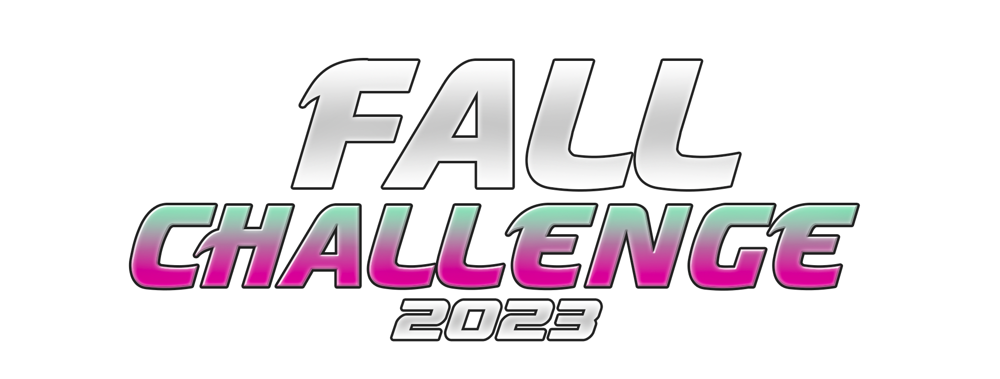

    

    This repository contains my solutions and strategies for the Codingame Fall Challenge 2023. It includes all the code, optimizations, and detailed explanations of my approach to tackling the challenges presented in the competition. Feel free to explore the solutions, provide feedback, and suggest improvements.

    
    

    

